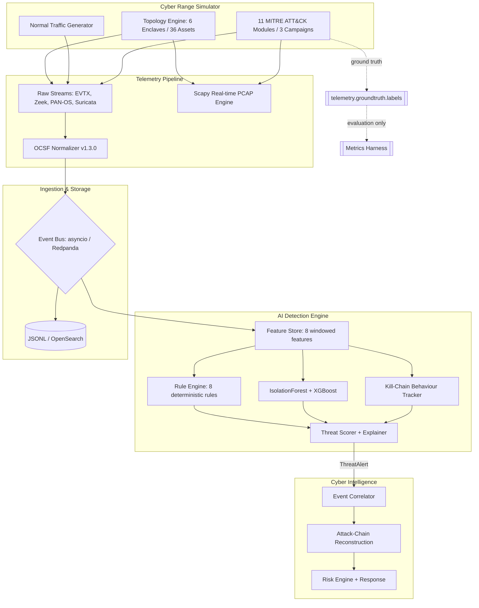

<h1 align="center">🎖️ Cyber Defense for Military Networks</h1>  
<p align="center">
**Digital Twin Cyber Range & OCSF-Normalized Telemetry Generator**
</p>  

---

[](https://www.python.org/)
[](https://fastapi.tiangolo.com/)
[](https://schema.ocsf.io/)
[](https://attack.mitre.org/)
[](#results--held-out-seeds-56-351138-vectors)
[](#owned-metrics)
[](https://www.docker.com/)
[](LICENSE)

**Cyber Defense for Military Networks** is a high-fidelity digital twin cyber range simulating multi-enclave defense networks (DMZ, NIPRNet, TOC, SIPRNet, Tactical Edge, and SCADA). It generates OCSF-normalized telemetry, captures real-time PCAP traffic, and executes safe MITRE ATT&CK adversary scenarios for defense evaluation.

---

## 📌 Core Features

- **Digital Twin Enclaves**: Simulates 36 network assets across 6 military domains (DMZ, NIPRNet, Tactical Operations Center, SIPRNet, Tactical Edge, and SCADA control systems).
- **OCSF v1.3.0 Telemetry Stream**: Generates Windows EVTX, Linux `auth.log`, Zeek conn/dns logs, PAN-OS firewall logs, and Suricata EVE security alerts normalized to OCSF schema.
- **MITRE ATT&CK Simulation**: Models 11 adversary techniques in-process without executing destructive malware (Password Spraying, Kerberoasting, HTTPS C2 Beaconing, DNS Tunnelling, Lateral Movement, etc.), composed into 3 multi-stage campaigns.
- **AI Detection Engine**: Windowed behavioural features, 8 deterministic rules, IsolationForest anomaly detection and an XGBoost threat classifier, producing explainable per-alert threat scores. Ground-truth labels travel on a separate topic, so the detection path never sees them.
- **Real-Time PCAP Generation**: Synthesizes `.pcap` packet captures dynamically via Scapy during adversary simulations.
- **Deterministic & Reproducible**: Every RNG stream is derived from one master seed via SHA-256, so a given seed reproduces a run byte-for-byte — a prerequisite for trustworthy metrics.
- **Dual Deployment Modes**:
  - **Lightweight Mode**: In-process `asyncio` pub/sub with JSONL persistence (< 1 GB RAM). SQLite backs the asset inventory.
  - **Full Mode**: Docker Compose streams telemetry through Redpanda (Kafka) into OpenSearch (4 GB+ RAM).

---

## 🔄 System Architecture



> The ground-truth channel is isolated by design: labels are published to a
> dedicated topic that only the evaluation harness subscribes to, so the
> detection path is structurally incapable of observing them.

---

## 🛡️ Enclave Topology & Simulated Enclaves

| Enclave Domain | Assets | Simulated Log Types | Security Boundary |
|---|---|---|---|
| **DMZ** | Public Web Servers, Mail Relays | PAN-OS Firewall, Nginx Access | Publicly accessible |
| **NIPRNet** | User Workstations, Domain Controller | Windows EVTX (4624, 4625), Zeek DNS | Unclassified Internal |
| **TOC** | Tactical Laptops, Command Consoles | Linux `auth.log`, Endpoint Events | Tactical Command |
| **SIPRNet** | Encrypted Relays, Command Server | Windows EVTX, Suricata EVE | Classified Internal |
| **Tactical Edge** | Radio Gateways, Field Devices | Flow Logs, Packet Traces | Low Bandwidth / High Jitter |
| **SCADA** | PLCs, Industrial Control Systems | Modbus/TCP Flow Logs, Suricata | Air-gapped Operational |

---

## 🤖 AI Detection Engine

Answers a single question — *is this behaviour suspicious?* — and emits a
validated `ThreatAlert` carrying a threat score, a confidence, a severity and
the evidence supporting the verdict.

### Feature Engineering

Features describe an **entity's behaviour over a sliding window**, not a single
event, because suspicion is a temporal property. One event may update several
entities; each produces a fixed-length 8-feature vector, so the models see a
stable schema.

| Entity | Key | Features derived |
|---|---|---|
| User | `user:<username>` | `failed_login_count`, `login_frequency`, `login_time_deviation` |
| Source host | `src_ip:<address>` | `connection_frequency`, `bytes_out`, `unique_destinations`, `port_entropy` |
| Asset | `asset:<hostname>` | `process_frequency` |

Two features warrant explanation:

**`port_entropy`** — Shannon entropy of the destination-port distribution, in
**raw bits, deliberately not normalised**:

$$H = -\sum_{i} p_i \log_2 p_i \qquad p_i = \frac{\text{count}(\text{port}_i)}{\sum \text{counts}}$$

Normalising by $\log_2 n$ would score six uniformly-hit ports and forty
uniformly-hit ports identically at 1.0, erasing the breadth signal that
separates a port sweep from an ordinary host. In raw bits a normal host sits
near 2.6 and a 20-port sweep exceeds 4.3.

**`login_time_deviation`** — hour-of-day is circular, so a linear mean places
23:00 and 01:00 twelve hours apart. Computed with directional statistics
against a per-user baseline:

$$\theta = \frac{2\pi h}{24}, \quad
\bar{R} = \sqrt{\overline{\sin\theta}^2 + \overline{\cos\theta}^2}, \quad
\sigma = \sqrt{-2\ln\bar{R}}$$

The deviation is the angular distance from the circular mean, scaled by
$\sigma$. Baselines require a minimum observation count, so a new account is
not flagged merely for being new.

### Rule Engine

Eight deterministic, auditable detections. Each carries a `priority` so a broad
contextual rule cannot outrank a specific one on a severity tie.

| ID | Detection | Threat type | Signal |
|---|---|---|---|
| `BF-001` | Brute force | Brute Force | ≥3 failed logons per entity in window |
| `PS-001` | Password spraying | Brute Force | ≥3 distinct accounts failing from one source |
| `SS-001` | Suspicious source | Recon / Cred. Compromise | External address reaching an internal asset |
| `PE-001` | Privilege escalation | Privilege Escalation | EVTX 4672, or a LOLBin at High/System integrity |
| `KB-001` | Kerberoasting | Credential Compromise | EVTX 4769 with RC4 (`0x17`) ticket encryption |
| `AP-001` | Abnormal port activity | Reconnaissance | `port_entropy` ≥ 3.5 bits over ≥10 distinct ports |
| `MI-001` | Malicious indicator | Command and Control | Known-bad IoC, or high-entropy DNS label (tunnelling) |
| `ID-001` | IDS signature | mapped by signature | Suricata signature → MITRE technique lookup |

### Models

| Component | Algorithm | Configuration | Role |
|---|---|---|---|
| Anomaly detector | `IsolationForest` | 200 estimators, `contamination='auto'` | Unsupervised; **fit on benign data only** to model "normal" |
| Threat classifier | `XGBClassifier` | 300 estimators, depth 6, lr 0.1, `multi:softprob` | Supervised; assigns one of 9 classes |
| Baseline | `RandomForestClassifier` | 300 estimators, `class_weight='balanced_subsample'` | Fallback when XGBoost is unavailable |

Scores from the rule, anomaly, classifier and behavioural paths are fused with
configurable weights (0.35 / 0.25 / 0.25 / 0.15). Weights **renormalise over
whatever signals are present**, so a rules-only deployment — before any model
has been trained — is not penalised. Inference runs off the event loop in a
dedicated thread and is micro-batched (64 events or 250 ms), so per-event
`predict()` calls cannot dominate detection latency.

### Behavioural & Explainability Layers

`BehaviourTracker` scores progression along the kill chain
`login anomaly → privilege escalation → process execution → lateral movement`,
enforcing order and applying time decay so a stale signal does not inflate a
current verdict. This is per-entity and complements — rather than duplicates —
the incident-level sequencing in `src/correlation/attack_reconstructor.py`.

Every alert carries a human-readable `evidence` string assembled from rule
hits, the top contributing features (importance × z-score against the benign
reference distribution) and the kill-chain state:

```
Reconnaissance on src_ip:198.51.100.99. 20 distinct destination ports with
port_entropy 4.32 bits (threshold 3.5) [AP-001]. anomaly score 0.94.
top features: port_entropy=4.32, unique_destinations=4.00,
connection_frequency=18.60. score 0.87, confidence 0.85.
```

SHAP is supported for per-prediction Shapley values but is **gated behind the
alert threshold and an optional import**, since applying it to every event
would distort the inference-time budget it is meant to be measured against.

---

## 📊 Dataset & Evaluation

### Methodology

Ground truth comes from the range itself: every event a campaign generates is
labelled with the MITRE technique that produced it, published to an isolated
topic. No hand-labelling, and no possibility of label leakage into features.

Three methodological choices determine whether the reported numbers mean
anything:

1. **Split by held-out seed, never by random row.** Feature vectors are
   windowed and stateful, so rows from one run share window state. A random
   row split would leak the test set into training and inflate every metric.
   Training uses seeds 1–3; evaluation uses seeds 5–6, never seen in training.
2. **Benign-only runs are generated alongside attacked runs.** These are the
   correct fit set for `IsolationForest` and the only way a false-positive rate
   is measurable at all.
3. **Benign traffic includes realistic failed logons.** 25% of workstation
   logins are preceded by 1–2 mistyped passwords. Without them, benign traffic
   would contain zero failed logons and any brute-force rule would score
   perfectly against a strawman.

For the same reason, `data/intel/indicators.json` **ships empty**. Seeding it
with the campaigns' own C2 addresses would make `MI-001` trivially perfect and
invalidate the C2 results; detection relies on DNS label entropy instead.

### Dataset Composition

Each seed contributes one attacked run and one benign-only run of 86,400
simulated seconds (24 h), giving a meaningful hour-of-day distribution for the
login-timing baseline.

| | Training | Evaluation |
|---|---|---|
| Seeds | 1–3 | 5–6 (held out) |
| Simulated duration | 6 × 24 h | 4 × 24 h |
| Feature vectors | **524,534** | **351,138** |
| Benign vectors | 522,842 (99.68%) | 350,010 (99.68%) |
| Malicious vectors | 1,692 (0.32%) | 1,128 (0.32%) |
| Classes | 9 (8 threat types + BENIGN) | 9 |

The 0.32% malicious rate is intentionally realistic. Class imbalance is handled
by `class_weight='balanced_subsample'` on the RandomForest baseline and by
softprob multi-class objective on XGBoost.

| Class | Train | Test |
|---|---|---|
| BENIGN | 522,842 | 350,010 |
| Data Exfiltration | 585 | 390 |
| Reconnaissance | 465 | 310 |
| Command and Control | 306 | 204 |
| Lateral Movement | 138 | 92 |
| Brute Force | 93 | 62 |
| Impact | 45 | 30 |
| Privilege Escalation | 36 | 24 |
| Credential Compromise | 24 | 16 |

### Feature Importance

XGBoost gain, from `data/models/training_report.json`:

| Feature | Importance |
|---|---|
| `connection_frequency` | 0.2548 |
| `login_frequency` | 0.1635 |
| `port_entropy` | 0.1620 |
| `process_frequency` | 0.1326 |
| `unique_destinations` | 0.1316 |
| `bytes_out` | 0.0882 |
| `failed_login_count` | 0.0370 |
| `login_time_deviation` | 0.0304 |

### Results — held-out seeds 5–6, 351,138 vectors

| Class | Precision | Recall | F1 | Support | TP | FP | FN |
|---|---|---|---|---|---|---|---|
| Reconnaissance | 0.969 | **1.000** | **0.984** | 310 | 310 | 10 | 0 |
| Data Exfiltration | 0.972 | 0.977 | **0.974** | 390 | 381 | 11 | 9 |
| Command and Control | 0.978 | 0.887 | **0.931** | 204 | 181 | 4 | 23 |
| Impact | 0.900 | 0.900 | 0.900 | 30 | 27 | 3 | 3 |
| Privilege Escalation | 0.783 | 0.750 | 0.766 | 24 | 18 | 5 | 6 |
| Lateral Movement | 0.882 | 0.652 | 0.750 | 92 | 60 | 8 | 32 |
| Brute Force | 0.893 | 0.403 | 0.556 | 62 | 25 | 3 | 37 |
| Credential Compromise | 0.242 | 0.500 | 0.327 | 16 | 8 | 25 | 8 |

| Aggregate | Precision | Recall | F1 |
|---|---|---|---|
| **Macro** | 0.827 | 0.759 | **0.773** |
| **Micro** | 0.936 | 0.895 | **0.915** |
| **Malicious vs benign** | 0.981 | 0.939 | **0.960** |

### Owned Metrics

| Metric | Result |
|---|---|
| **Precision / Recall / F1** | 0.936 / 0.895 / 0.915 (micro), 0.773 macro F1 |
| **False-positive rate** | **0.0057%** — 20 false positives across 350,010 benign vectors |
| **Detection latency** | p50 0.0 s, p99 180.7 s, mean 11.3 s (simulation time) |
| **Inference time** | p50 **0.21 ms**, p95 0.28 ms, p99 0.34 ms per event |
| **Kill-chain coverage** | **16/16** campaign stages detected |

Detection latency is measured per campaign stage, from the first malicious
event of that stage to the first alert raised on it. A p50 of 0.0 s means the
majority of stages are detected on their first observable event.

### Known Limitations

Reported plainly, because they are properties of the design rather than tuning
artifacts:

- **Brute Force recall (0.403).** Password spraying produces one failed logon
  per account, so per-*user* vectors never reach the `BF-001` threshold. The
  pattern is caught at source level by `PS-001`, but the per-user vectors are
  still counted as misses under entity-level labelling.
- **Credential Compromise precision (0.242 on 16 samples).** `SS-001` is a
  broad contextual rule and over-attributes on the auth stream. The support is
  too small for the figure to be stable.
- **Lateral Movement recall (0.652).** Multi-host movement generates vectors on
  intermediate entities that carry little distinguishing signal on their own.
- **Alert volume.** Detection is per feature vector, so a sustained
  exfiltration raises many alerts. A 300 s per-entity cooldown suppresses
  duplicates; incident grouping is the correlation layer's responsibility.

### Reproducing These Numbers

Every stage is seeded; the same seed reproduces a run exactly.

```bash
python scripts/build_dataset.py --train-seeds 1-3 --test-seeds 5-6 --duration 86400
python scripts/train_detection.py
python scripts/evaluate_detection.py --seeds 5-6 --duration 86400
```

Artifacts: `data/datasets/{train,test}.json`,
`data/models/{anomaly,classifier}.joblib`,
`data/models/training_report.json`, `data/output/detection_metrics.json`.

---

## 🚀 Quickstart & Setup

### Prerequisites
- Python 3.11+ (the container image is `python:3.11-slim`; dependency pins
  also carry cp313 wheels, so 3.11–3.13 are supported)
- Optional: Docker & Docker Compose (for Full Mode)

### Installation

```bash
git clone https://github.com/nayefsiddique-eng/Cyber-Defense-for-Military-Networks.git
cd Cyber-Defense-for-Military-Networks

python -m venv .venv
source .venv/bin/activate            # Windows: .\.venv\Scripts\Activate.ps1

pip install -r requirements.txt      # runtime
pip install -r requirements-dev.txt  # tests + SHAP

cp .env.example .env                 # optional; all settings have defaults
```

Data directories are created on demand. Verify the install:

```bash
pytest
```

---

## 💻 Usage Commands

### 1. Launch FastAPI Control Plane
```bash
python -m src.main api
```
Access interactive control panel at `http://localhost:8000/docs`.

### 2. Run the Simulation Engine
```bash
# Benign background traffic only
python -m src.main simulate --duration 3600 --seed 42

# With adversary campaigns
python -m src.main simulate --duration 86400 --seed 7 \
    --attacks apt_campaign insider_threat ransomware_precursor
```
Generates OCSF-normalized telemetry in `data/telemetry/`. The same seed
reproduces a run exactly.

### 3. Run the AI Detection Engine
```bash
python -m src.main detect --duration 86400 --seed 7
```
Simulates, normalizes and detects in one process, printing explainable
`ThreatAlert`s. Runs rules-only when no model is present and loads models from
`data/models/` when they are, so it is useful before any training has happened.

### 4. Train and Evaluate the Detector
```bash
# Labelled dataset, split by held-out seed (never by random row -
# windowed features would leak the test set into training)
python scripts/build_dataset.py --train-seeds 1-3 --test-seeds 5-6 --duration 86400

python scripts/train_detection.py                    # IsolationForest + XGBoost
python scripts/evaluate_detection.py --seeds 5-6     # P/R/F1, FPR, latency
```
Writes `data/output/detection_metrics.json`. See
[Dataset & Evaluation](#-dataset--evaluation) for the published results.

### 5. Run Pipeline Consumer
```bash
python -m src.main pipeline
```
Listens to event bus streams, normalizes to OCSF format, and persists events.

### 6. Full Mode Deployment (Docker Compose)
```bash
docker compose up -d
```
Spins up Redpanda event broker, OpenSearch indexing node, and FastAPI management API.

---

## 📁 Repository Structure

```
Cyber-Defense-for-Military-Networks/
├── data/
│   ├── db/                    # SQLite asset inventory
│   ├── telemetry/             # OCSF JSONL output
│   ├── pcaps/                 # Scapy packet captures
│   ├── datasets/              # Labelled train/test feature tables
│   ├── models/                # Persisted models + training report
│   ├── intel/                 # Threat-intel indicators (ships empty)
│   └── output/                # Incident reports, detection_metrics.json
├── scripts/
│   ├── build_dataset.py       # Labelled dataset, split by held-out seed
│   ├── train_detection.py     # Fit IsolationForest + XGBoost
│   └── evaluate_detection.py  # P/R/F1, FPR, latency, inference time
├── src/
│   ├── api/                   # FastAPI routes & control panel endpoints
│   ├── attacks/               # MITRE ATT&CK modules, campaigns, registry
│   ├── correlation/           # Alert correlation, attack chains, risk, response
│   ├── detection/             # Features, rules, ML, behaviour, explainability
│   ├── models/                # OCSF v1.3.0 schema models & asset inventory
│   ├── pipeline/              # RawEvent contract, normalizer, bus, storage
│   ├── simulator/             # Digital twin topology engine & normal traffic
│   ├── telemetry/             # PCAP engine & log formatters (EVTX, Zeek, Suricata)
│   ├── config.py
│   └── main.py                # CLI entrypoint (api, simulate, detect, pipeline)
├── tests/                     # Unit + integration test suite
├── docker-compose.yml
├── requirements.txt           # Runtime dependencies
└── requirements-dev.txt       # Tests + SHAP
```

---

## 🧪 Testing & Determinism

```bash
pytest                         # 67 tests
pytest --cov=src --cov-report=term-missing
```

Coverage spans the simulator, event bus, storage sink, OCSF normalizer, attack
registry and adapter, feature extraction, every rule, the behaviour tracker and
score fusion. Notable invariants asserted by the suite:

- **Losslessness** — every generated event reaches the bus, is normalized and
  is persisted; counts must agree at each stage.
- **Determinism** — two runs at the same seed produce identical event
  distributions; different seeds diverge.
- **Consumer isolation** — two consumer groups on one topic each receive every
  message, rather than competing for a shared queue.
- **No label leakage** — no ground-truth field ever appears in an event payload
  on a `telemetry.raw.*` topic.
- **Contract integrity** — every `threat_type` a rule can emit is understood by
  `AttackReconstructor.THREAT_MAPPING` and scored by `RiskEngine.STAGE_SCORES`;
  an unmapped type would be silently dropped downstream.
- **Negative cases** — each rule is asserted to stay *silent* on benign input,
  not merely to fire on malicious input.
