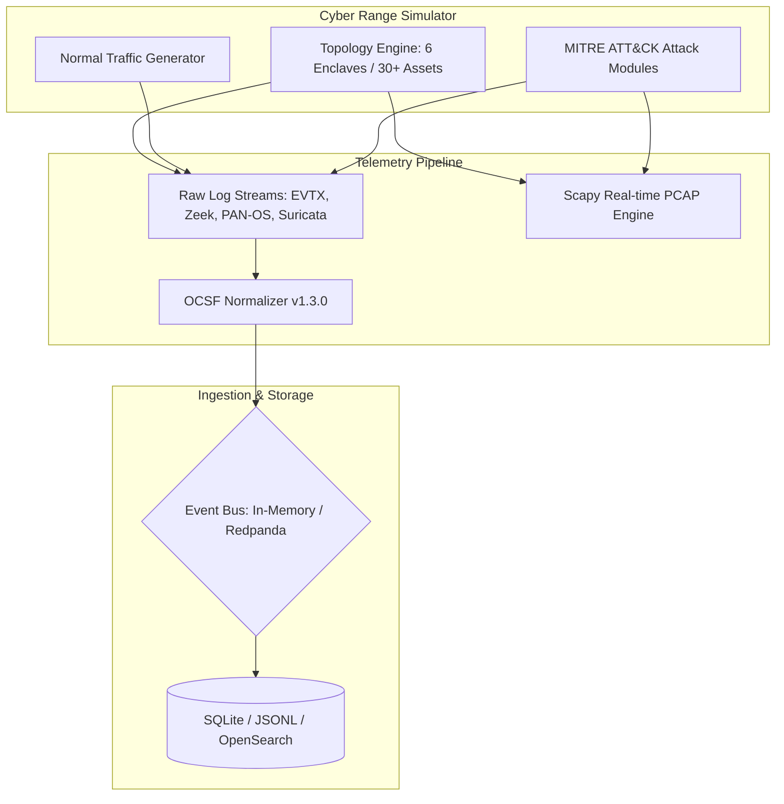

# 🎖️ Cyber Defense for Military Networks

**Digital Twin Cyber Range & OCSF-Normalized Telemetry Generator**

[](https://www.python.org/)
[](https://fastapi.tiangolo.com/)
[](https://schema.ocsf.io/)
[](https://www.docker.com/)
[](LICENSE)

**Cyber Defense for Military Networks** is a high-fidelity digital twin cyber range simulating multi-enclave defense networks (DMZ, NIPRNet, TOC, SIPRNet, Tactical Edge, and SCADA). It generates OCSF-normalized telemetry, captures real-time PCAP traffic, and executes safe MITRE ATT&CK adversary scenarios for defense evaluation.

---

## 📌 Core Features

- **Digital Twin Enclaves**: Simulates 30+ network assets across 6 military domains (DMZ, NIPRNet, Tactical Operations Center, SIPRNet, Tactical Edge, and SCADA control systems).
- **OCSF v1.3.0 Telemetry Stream**: Generates Windows EVTX, Linux `auth.log`, Zeek conn/dns logs, PAN-OS firewall logs, and Suricata EVE security alerts normalized to OCSF schema.
- **MITRE ATT&CK Simulation**: Models 7 adversary techniques in-process without executing destructive malware (Password Spraying, Kerberoasting, HTTPS C2 Beaconing, Lateral Movement, etc.).
- **Real-Time PCAP Generation**: Synthesizes `.pcap` packet captures dynamically via Scapy during adversary simulations.
- **Dual Deployment Modes**:
  - **Lightweight Mode**: Runs completely in-memory via `asyncio.Queue` and SQLite/JSONL (< 1 GB RAM).
  - **Full Mode**: Leverages Docker Compose to stream telemetry through Redpanda (Kafka) into OpenSearch (4 GB+ RAM).

---

## 🔄 System Architecture



---

## 🛡️ Enclave Topology & Simulated Enclaves

| Enclave Domain | Assets | Simulated Log Types | Security Boundary |
|---|---|---|---|
| **DMZ** | Public Web Servers, Mail Relays | PAN-OS Firewall, Nginx Access | Publicly accessible |
| **NIPRNet** | User Workstations, Domain Controller | Windows EVTX (4624, 4625), Zeek DNS | Unclassified Internal |
| **TOC** | Tactical Laptops, Command Consoles | Linux `auth.log`, Endpoint Events | Tactical Command |
| **SIPRNet** | Encrypted Relays, Command Server | Windows EVTX, Suricata EVE | Classified Internal |
| **Tactical Edge** | Radio Gateways, Field Devices | Flow Logs, Packet Traces | Low Bandwidth / High Jitter |
| **SCADA** | PLCs, Industrial Control Systems | Modbus/TCP Flow Logs, Suricata | Air-gapped Operational |

---

## 🚀 Quickstart & Setup

### Prerequisites
- Python 3.10+
- Optional: Docker & Docker Compose (for Full Mode)

### Installation

```bash
# Clone repository
git clone https://github.com/nayefsiddique-eng/Cyber-Defense-for-Military-Networks.git
cd Cyber-Defense-for-Military-Networks

# Create virtual environment
python -m venv .venv
source .venv/bin/activate  # On Windows: .\.venv\Scripts\Activate.ps1

# Install requirements
pip install -r requirements.txt

# Prepare data directories
mkdir -p data/db data/telemetry data/pcaps data/scenarios
```

---

## 💻 Usage Commands

### 1. Launch FastAPI Control Plane
```bash
python -m src.main api
```
Access interactive control panel at `http://localhost:8000/docs`.

### 2. Run Standalone Simulation Engine
```bash
python -m src.main simulate --duration 3600 --seed 42
```
Generates raw & normalized telemetry logs in `data/telemetry/`.

### 3. Run Pipeline Consumer
```bash
python -m src.main pipeline
```
Listens to event bus streams, normalizes to OCSF format, and persists events.

### 4. Full Mode Deployment (Docker Compose)
```bash
docker compose up -d
```
Spins up Redpanda event broker, OpenSearch indexing node, and FastAPI management API.

---

## 📁 Repository Structure

```
Cyber-Defense-for-Military-Networks/
├── data/                      # Local database, PCAPs, and telemetry logs
├── src/
│   ├── api/                   # FastAPI routes & control panel endpoints
│   ├── attacks/               # MITRE ATT&CK modules (C2, Exfiltration, Lateral)
│   ├── models/                # OCSF v1.3.0 schema models & asset inventory
│   ├── pipeline/              # Normalizer, event bus, & storage engine
│   ├── simulator/             # Digital twin topology engine & normal traffic
│   ├── telemetry/             # PCAP engine & log formatters (EVTX, Zeek, Suricata)
│   ├── config.py
│   └── main.py                # CLI entrypoint (api, simulate, pipeline)
├── tests/                     # Unit test suite
├── docker-compose.yml
└── requirements.txt
```
